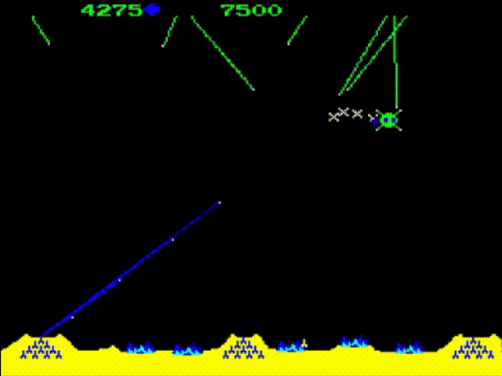
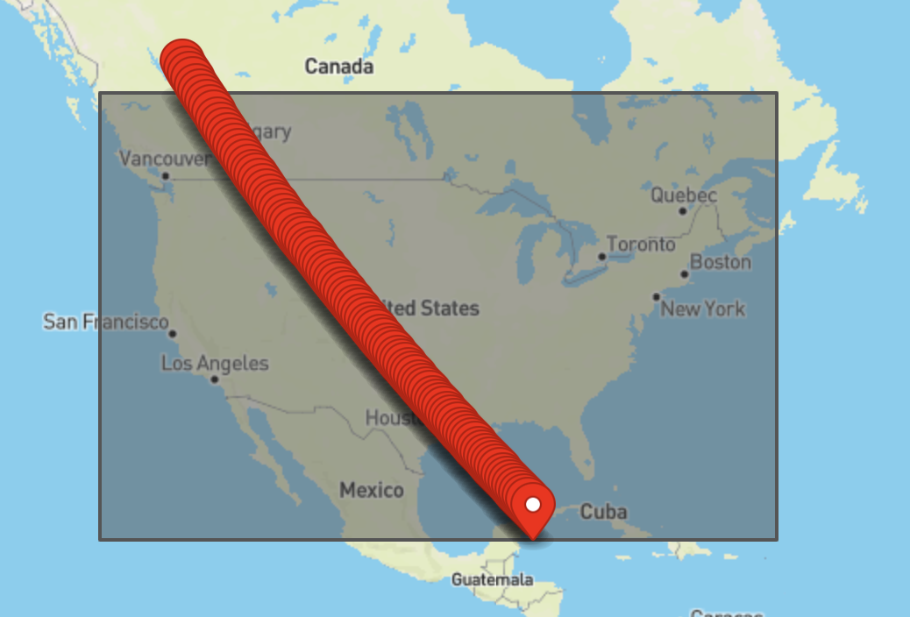
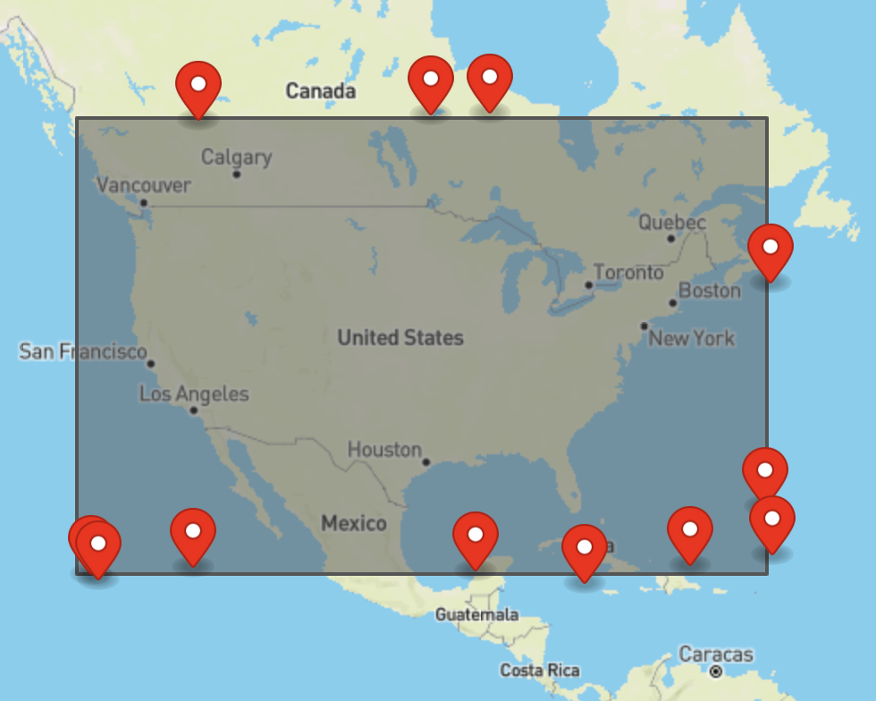

## Project 3 - Missile Command (Part 1)
#### Due: 09-29-2022 (Thursday @ 3:30 p.m.)

<center>

</center>

## Overview

Missile Command was an 80's arcade game in which the player had to defend earth using anti-missile batteries that shot defensive "clouds" into the air (see animation). We will create our own "no graphics" implementation of the game incorporating our spatial db concepts. This first part of the game is to determine how many military bases, and to generate a series of missile paths which intersect with a military base and get shot down. The second part we will attempt to do something in real time with missiles coming at different speeds and altitudes, and each military base will have limited reaction time, giving them a chance to get hit. This first part is only generating random paths and simple line v polygon intersection recognition.

## Data 

We will need two datasets: 
1. [military installations](https://www2.census.gov/geo/tiger/TIGER2021/MIL/tl_2021_us_mil.zip)
2. A randomly generated set of missile paths across the continental US.

### Military Installations

Use as many of the larger military bases to defend the continent. There are > 70 bases that are larger then 50 square miles. This should be more than enough to defend the US from missiles. What that number actually is can be debated in class after everyone has seen the geometries.  We can assume that any "missile" (MultiLineString) that crosses within some Δ (delta distance) of a base, then the base will fire a missile. The first part of this project is to simply calculate whether a missiles path intersects with a military bases geometry + some β (buffer) around the base. 

#### Helpful Links: 
- https://postgis.net/docs/ST_Buffer.html
- http://postgis.net/docs/manual-1.5/ch04.html#PostGIS_Geography


#### Helpful Sql: 
 
Calculate the area of a geometry:
```sql
SELECT fullname,ST_Area(geom::geography)* 0.00000038610 sqmiles 
FROM military_bases
ORDER BY sqmiles DESC
```

### Missile Paths

Using the bounding box I provided [here](us_bbox.geojson), generate M number of missile paths coming from every direction. By randomly generating two points on opposing sides of the bounding box, you can then interpolate points two generate a MultiLineString. We need a MultiLineString because we will be adding timestamps and altitudes at each point for the next project.  You can easily interpolate points using PostGis. 

#### Helpful Links:

- https://postgis.net/docs/ST_LineInterpolatePoints.html

#### Helpful Sql:

SQL to interpolate points between two ends at 1 percent intervals:
```sql
SELECT ST_AsGeoJSON(
    ST_LineInterpolatePoints('LINESTRING(-121.81640624999999 54.36775852406841,-86.396484375 19.72534224805787)', 0.01))
```



SQL to generate points along a polygon (bbox) with a tight buffer:
```sql
SELECT ST_AsGeoJSON(J.*) FROM (SELECT ST_GeneratePoints(geom, 12, 1996) 
FROM (
SELECT ST_Buffer(
	ST_GeomFromText('LINESTRING(-129.7844079 19.7433195,-61.9513812 19.7433195 , -61.9513812 54.3457868,-129.7844079 54.3457868)'),
  1, 'endcap=round join=round')  As geom ) as s )as J;
  ```

  

### Resources

- https://postgis.net/docs/ST_Centroid.html
- https://postgis.net/docs/ST_Envelope.html
- https://postgis.net/docs/Find_SRID.html
- https://postgis.net/docs/ST_Area.html
- https://postgis.net/docs/ST_AsGeoJSON.html

Sql query to create a bounding box, and get the center of the bbox as well as the geometery.
They turn out to be almost identical.
```sql
SELECT fullname,ST_AsText(ST_Envelope(geom)) bbox,  ST_AsText(ST_Centroid(ST_Envelope(geom))) bboxcenter,  ST_AsText(ST_Centroid(geom)) center
FROM military_bases
ORDER BY fullname ASC
```


## Deliverables

TBD