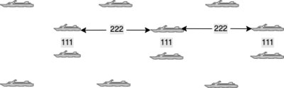
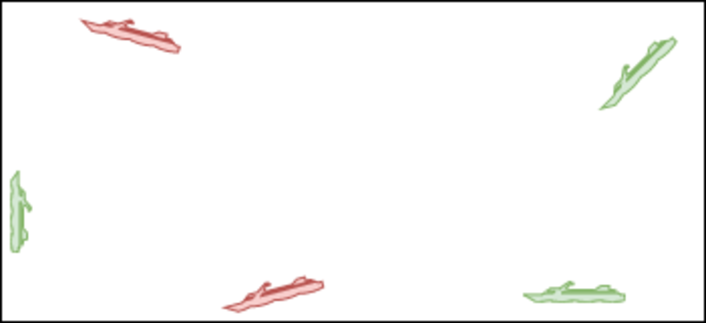

## Project 4.1 - Battle Ship
#### Due: 11-22-2022 (Tuesday @ 3:30 p.m.)

## Steaming To Battle


### Problem Statement:

- Given:
  - A bounding box: `bbox` with upper left and lower right coordinates.
  - A json list of ships like this one: [ships.json](ships.json).
- Determine how many ships are in your fleet (by counting them im ships.json).
- Then generate a `pseudo random` location for each ship within a given `bbox` and at a specified "sector" within that `bbox`. You can acheive this by generating a single point pseudo-randomly, then placing your ships accordingly starting with that point.


### Some Stipulations

#### PostGres
  - After initially reading in your ship data, and loading the values into a Postgres table, ALL calculations mentioned in this assignment will be done via PostGis / PostGres.

#### Ship Location and Orientation
  - Each ship should be facing the same direction.
  - Your ships should be spaced apart and staggered (see image below).
    - 111m from port to starboard
    - 222m from bow to stern
    - You can be +/- 5 meters 
- Depending on where your ships materialize, be cognizant of each of your ships bearings. You don't want to immediately start leaving the battle area (see image below)
- The "sector" will be chosen via a cardinal direction. 

## Examples
<sup>If the images are to hard to see, click on them...</sup>

### Bounding Box

Here is the structure of the bounding box we will be using. 

```json
{
    "UpperLeft": {"lon": -10.31324002, "lat": 50.17116998},
    "LowerRight": {"lon": -8.06068579, "lat": 48.74631646},
}
```

### Spacing / Staggering

Below is an example of the spacing / staggering for your ships. 

<a href="./images/ship_alignment_400x.png"></a>

### Bearing

Ships that generate near game borders need to be cognizant of their direction. I laugh when I look at that images as it is something the military would actually do :) Kid style image for a battle fleet ...

<a href="./images/ship_direction_1024x.png"></a>

### Sectors

Here are sectors listed out visually on a compass. Normally sectors would use a grid system, but what's the fun in giving you an even smaller bounding box to generate coordinates in. That's too easy.

<a href="./images/cardinal_grid_1024x.png"></a>

In this next example, the sector "NE" (North East) was specified for the fleet to materialize in. Notice the direction is away from one of the nearest game borders, and parallel with the other. 

<a href="./images/cardinal_grid_small_1024x.png"></a> |


### Cardinal Direction From Degrees

Here is how to convert degrees to a "cardinal direction":

```python
cardinalList = ["N","NNE","NE","ENE","E","ESE","SE","SSE",
        "S","SSW","SW","WSW","W","WNW","NW","NNW"]
degrees = int(float(degrees))
index = int((degrees + 11.25) / 22.5)
direction = cardinalList[index % 16]
```


#### Table of Degree Ranges

Below is a table showing the ranges for each cardinal direction. This table was built using the above "formula".

| Direction | From d° | Middle d° |   To d° |
| :-------- | ------: | --------: | ------: |
| N         | 348.750 |     0.000 |  11.250 |
| NNE       |  11.250 |    22.500 |  33.750 |
| NE        |  33.750 |    45.000 |  56.250 |
| ENE       |  56.250 |    67.500 |  78.750 |
| E         |  78.750 |    90.000 | 101.250 |
| ESE       | 101.250 |   112.500 | 123.750 |
| SE        | 123.750 |   135.000 | 146.250 |
| SSE       | 146.250 |   157.500 | 168.750 |
| S         | 168.750 |   180.000 | 191.250 |
| SSW       | 191.250 |   202.500 | 213.750 |
| SW        | 213.750 |   225.000 | 236.250 |
| WSW       | 236.250 |   247.500 | 258.750 |
| W         | 258.750 |   270.000 | 281.250 |
| WNW       | 281.250 |   292.500 | 303.750 |
| NW        | 303.750 |   315.000 | 326.250 |
| NNW       | 326.250 |   337.500 | 348.750 |


## Product

The final product you need to produce will be structured like the object below.
Obviously the actual lon/lat values will be different, so don't go "checking" values using the values below.

```json
"fleet_id":dd
"ship_status":[
    {"ship_id":0,"bearing":33.456,"location":{"lon":12.1234,"lat":12.1234}},
    {"ship_id":1,"bearing":33.456,"location":{"lon":23.1234,"lat":23.1234}},
    ...
    {"ship_id":N,"bearing":33.456,"location":{"lon":dd.ffff,"lat":dd.ffff}}
]
```

## Deliverables

- Create a folder called `P04.1` in your github repo for this course.
- Put all code and copies of the sql to create and load your tables in this folder as well. Each tables structure and data should be in a single file representing that table with the file name being the same as the table name. 
- Place a copy of your final product with the location of each ship printed into its own file called `final_product.json`.
  


