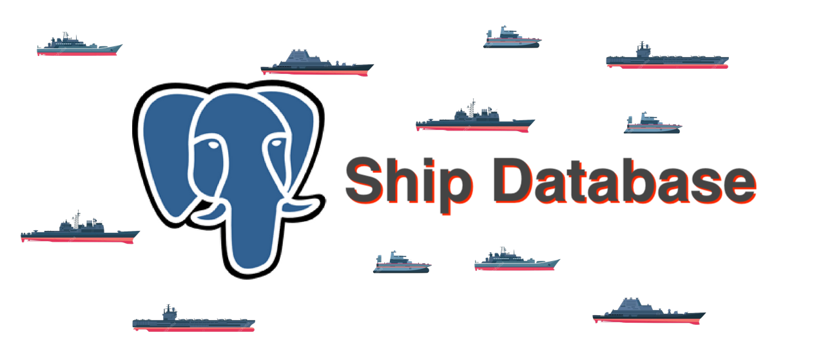

## Project 4.2 - BS: Database Creation
#### Due: 11-27-2022 (Sunday @ 6:00 p.m.)


## Game Database



### Problem Statement:

- The file [ships.json](ships.json) has a lot of information in different categories including: ship info, ships armaments (guns and location), types of ammo and ammo counts. 
- This data needs storing in a set of tables in postGres so it can be used during the game.


### Discussion

The goal for creating the database, as you all know, is to allow us to run queries to pull information or update information in an easy manner. So, I will give you some possible queries to think about before creating your tables.

- Firing the guns for one of your ships. 
- Change the speed and direction of a specific ship.
- Change the direction of your fleet.
- Rotate the guns on one of your ships.
- Fire a torpedo.
- **Possible Advanced Queries**
  - To keep track of the enemy, and find patterns, you may want to store enemy fleets locations as well so you can perform some kind of tracking or rudimentary prediction as to their next location. 
  
-------

What do all of these queries entail? Well to fire the guns for a ship you need to do the following:
  - Creating a fire solution requires getting the guns elevation, guns bearing, ammo type, and current time at a minimum. 
  - The "[ship](./data/ship.sql)" table (at the moment) has no information about a guns bearing, guns elevation, its ammo type, and if it has ammo.
  - So the tables I provided will have to altered or additional tables added to keep track of the state of your fleet.  

A table called `ShipState` could be useful. Lets make one.
```sql
-- This table keeps track of each ships bearing, speed, and its location.
CREATE TABLE ship_state (
    ship_id numeric NOT NULL,
    bearing float,
    speed numeric
    location coord
);
```

Also a table called `GunState` could be useful. Lets make one.
  
```sql
-- This table keeps track of a specific ships guns, direction each is facing, their elevation, and how much ammo. 
CREATE TABLE gun_state (
    ship_id numeric,
    gun_id numeric,
    bearing float,
    elevation float,
    ammo numeric,
);
```
------

- I will provide a set of helper files to create very basic tables. There are no primary or foreign keys provided, that is something you will **need to add**. 
- I took some short cuts when I created my tables by allowing json in some columns. But this allows the query's to be easier, and not force us to create more tables with normalized data.

| Table Name | File Name                               | description                                                      |
| :--------- | :-------------------------------------- | :--------------------------------------------------------------- |
| cartridge  | [cartridge.sql](./data/cartridge.sql)   | Describes projectiles with gunpowder packed within the case      |
| gun        | [gun.sql](./data/gun.sql)               | Gives info about each gun like ammo and size                     |
| projectile | [projectile.sql](./data/projectile.sql) | This describes projectiles with no case. Uses bags of propellant |
| ship_guns  | [ship_guns.sql](./data/ship_guns.sql)   | This describes guns on a specific ship with their location       |
| ship       | [ship.sql](./data/ship.sql)             | Has all info about each ship                                     |
| torpedo    | [torpedo.sql](./data/torpedo.sql)       | Describes the different torpedo's                                |

## Database Creation

You can create your database as you see fit. However, everything that is possible to do for the battleship game with postGres queries, will be done with postGres queries. So think long and hard about the above example queries, but any other that may occur throughout the implementation of your game.

You can use anything I gave you, plus you may ask for my help at anytime. But it must be soon, we are in a hurry.

## Deliverables

- Create a folder called `P04.2` in your assignments folder.
- Place a copy of your db schema in this folder. 
- Separate files for separate table with their data, if data is short enough to fit on a page, other wise just the first N rows (enough for 1 page).
- Example queries and their outputs, implemented based on the 5 examples in the discussion above, as executed on your created DB. This is a large part of this assignment.

