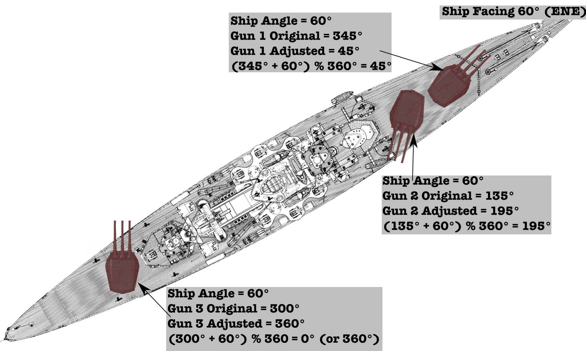

## Project 4.4 - BS: Firing Your Guns!
#### Due: 11-29-2022 (Tuesday @ 3:30 p.m.)

### Example 1

The ship has a bearing straight north, and the guns are in line with the ship. Easy to determine which direction the guns are facing since the ship is straight north. 

-----

-----

-----

-----

