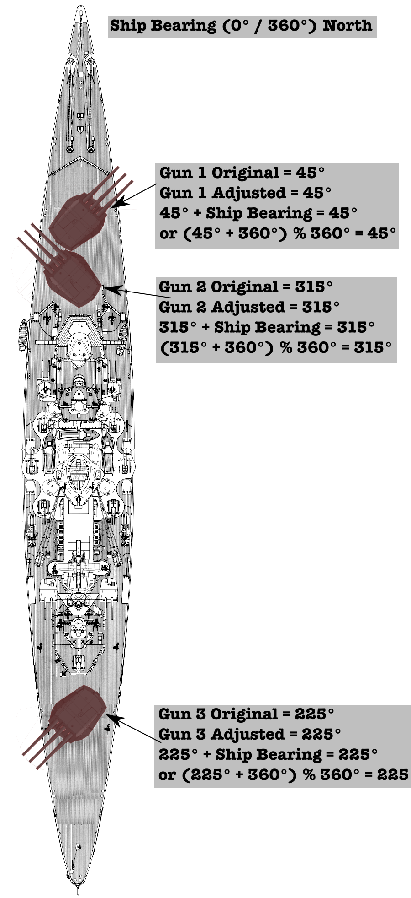

## Project 4.4 - BS: Firing Your Guns!
#### Due: 12-01-2022 (Tuesday @ 3:30 p.m.)

## Your guns bearing

Each firing solution has to include the guns bearing that you are firing. Obviously other things are needed as well, but I think we all need to be on the same page for determining the "bearing" of a gun on a ship that can be oriented at least 360 different ways. I thought about snapping ships and guns to 5 degree increments, but felt that could hamper small changes to projectiles that a team might want to make. Anyway, below are a set of examples on how I see the guns bearings in relation to its ship.

### Examples

#### Example 1

- Ship: Bearing 0 degrees or 360 degrees (straight north)
  - Gun 1: Pointed 0 degrees in relation to ship
  - Gun 2: Pointed 0 degrees in relation to ship
  - Gun 3: Pointed 180 degrees in relation to ship
  
No adjustments needed since the ship has a heading of 0 degrees.

#### Example 2

- Ship: Bearing 0 degrees or 360 degrees (straight north)
  - Gun 1: Pointed 45 degrees in relation to ship
  - Gun 2: Pointed 315 degrees in relation to ship
  - Gun 3: Pointed 225 degrees in relation to ship

This also doesn't need any adjustments to the bearing of each gun as the ship has a heading of 0 degrees.

#### Example 3

- Ship: Bearing 60 degrees
- Gun 1: Pointed 345 degrees in relation to ship
- Gun 2: Pointed 135 degrees in relation to ship
- Gun 3: Pointed 300 degrees in relation to ship

Now we adjust our gun bearings based on the ship bearing.

  - Gun 1: 60 + 345 = 405 % 360 = 45
  - Gun 2: 60 + 135 = 195 % 360 = 195
  - Gun 3: 60 + 300 = 360 % 360 = 0

#### Example 4

- Ship: Bearing 330 degrees
- Gun 1: Pointed 30 degrees in relation to ship
- Gun 2: Pointed 75 degrees in relation to ship
- Gun 3: Pointed 210 degrees in relation to ship

Now we adjust our gun bearings based on the ship bearing.

  - Gun 1: 330 + 30 = 360 % 360 = 0
  - Gun 2: 330 + 75 = 405 % 360 = 45
  - Gun 3: 330 + 210 = 540 % 360 = 180

## Your guns bearing
